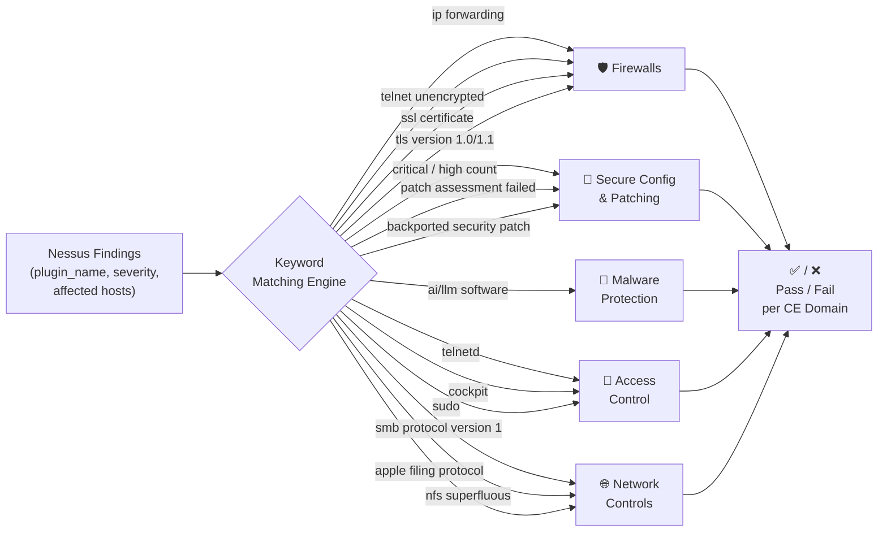

# Cyber Essentials Mapping

The report automatically evaluates scan findings against the **Cyber Essentials v3.1** framework — a UK government-backed certification scheme covering five core security controls.

Each check is derived dynamically from Nessus plugin names and scan data. No manual review is required.

---

## How the Mapping Works

For each finding, the engine checks whether the **Nessus plugin name** contains specific keywords. If matched, the finding is mapped to the relevant CE check and the affected hosts and CVEs are extracted automatically.

---

## Domain 1 — Firewalls 🛡️

**CE requirement:** All devices must be protected by a properly configured boundary firewall. Unsolicited inbound connections must be blocked, and only encrypted protocols should be used for remote access.

| CE Check | Nessus Plugin Keyword(s) | Severity Filter | What it detects |
|---|---|:---:|---|
| IP forwarding enabled | `ip forwarding` | Any | Host is routing traffic between network interfaces, bypassing firewall boundary controls |
| Unencrypted Telnet | `telnet` + `unencrypted` **or** `telnet` + `cleartext` | Any | Telnet service transmitting credentials and data in plaintext |
| Untrusted SSL certificate | `ssl certificate cannot be trusted` **or** `ssl self-signed certificate` | Any | Management interface using an untrusted or self-signed certificate, enabling MitM attacks |
| Deprecated TLS versions | `tls version 1.0` **or** `tls version 1.1 deprecated` | Any | Service still accepting TLS 1.0 or 1.1, which are no longer considered secure |

:::warning CE requirement
TLS 1.0 and 1.1 must be disabled. Only TLS 1.2 and above are acceptable under CE v3.1.
:::

---

## Domain 2 — Secure Configuration & Patching 🔧

**CE requirement:** Devices must be securely configured. Critical and high severity patches must be applied within **14 days** of release. Default passwords must be changed and unnecessary software removed.

| CE Check | Data Source | What it detects |
|---|---|---|
| Unpatched critical/high findings | Severity count from aggregated results | Total number of Critical and High findings across all hosts |
| Credentialed patch assessment failed | Plugin: `OS Security Patch Assessment Failed` | Hosts where Nessus could not verify installed patch levels — findings may be incomplete |
| Most vulnerable host | Asset with highest `critical_count` | Highlights the asset most behind on patching |
| Backported patches confirmed | Plugin: `Backported Security Patch` | Linux distributions (e.g. Ubuntu, Oracle) apply security fixes to older package versions — this confirms the mechanism was detected |

:::info About backported patches
Backporting is an accepted patching method under CE. A version number that looks outdated may still be fully patched via backports — this check confirms when Nessus detected this pattern.
:::

---

## Domain 3 — Malware Protection 🦠

**CE requirement:** All in-scope devices must have malware protection software installed, actively running, and kept up to date.

| CE Check | Nessus Plugin Keyword(s) | What it detects |
|---|---|---|
| No active malware indicators | *(absence of malware-family findings)* | No malware-related plugin families detected in scan results |
| Unapproved AI/LLM software | `ai/llm software` **or** `ai software report` | AI or large language model software detected on a host that may not be on the approved software list |

:::note Scope limitation
Nessus vulnerability scans are not a substitute for dedicated AV/EDR solutions. The absence of malware indicators in a scan does not confirm a host is malware-free — it only confirms no *known vulnerability indicators* associated with malware were found.
:::

---

## Domain 4 — Access Control 🔑

**CE requirement:** User accounts must be controlled. Only authorised individuals should have access to systems and data. Privilege must be limited to what is necessary (least privilege).

| CE Check | Nessus Plugin Keyword(s) | Severity Filter | What it detects |
|---|---|:---:|---|
| Authentication bypass on Telnet | `telnetd` | Critical only | Telnet daemon vulnerability allowing unauthenticated access |
| Unauthenticated RCE via Cockpit | `cockpit` | Critical only | Cockpit web console vulnerability enabling remote code execution without credentials |
| Sudo privilege escalation | `sudo` | Any | Sudo misconfiguration or CVE allowing a local user to escalate to root |
| SSH authentication | *(credentialed scan confirmation)* | — | Valid credentials were required for SSH access — confirms authentication is enforced |

:::danger Critical CE violation
Unauthenticated RCE (remote code execution without valid credentials) is a direct CE violation. Any finding in this category should be treated as the highest priority remediation.
:::

---

## Domain 5 — Network Controls 🌐

**CE requirement:** Network boundaries must be controlled. Only necessary network services should be exposed. Insecure and legacy protocols must be disabled.

| CE Check | Nessus Plugin Keyword(s) | What it detects |
|---|---|---|
| SMBv1 enabled | `smb` + `protocol version 1` **or** `smbv1 detected` | SMBv1 is deprecated and was exploited by WannaCry/EternalBlue ransomware; must be disabled |
| Unnecessary NFS exposed | `nfs server superfluous` **or** `nfs` + `superfluous` | NFS file sharing exposed when not required, increasing attack surface |
| Legacy AFP file sharing | `apple filing protocol` | Apple Filing Protocol is legacy and should be disabled if not actively required |
| Boundary device identified | Asset classification: Router/Gateway | Confirms a network boundary device was detected in the scan scope |

---

## Pass / Fail Verdict

After all checks are evaluated, the report assigns an overall CE readiness verdict:

| Outcome | Condition |
|---|---|
| ✅ **PASS** | Zero failed checks across all five domains |
| ⚠️ **REVIEW** | 1–3 failed checks — minor remediation required |
| ❌ **FAIL** | 4 or more failed checks — significant remediation required before CE assessment |

---

## Scan Coverage Warning

If any host was scanned **without credentials**, CE checks for that host may be incomplete. Credentialed scans allow Nessus to inspect:

- Installed software and patch versions
- Running processes and local configurations
- Sudo rules and local user permissions

Hosts that failed credentialed assessment are flagged with a **⚠ No Cred** badge in the Assets view. CE domains affected by uncredentialed hosts are: **Secure Configuration & Patching**, **Access Control**, and **Malware Protection**.
