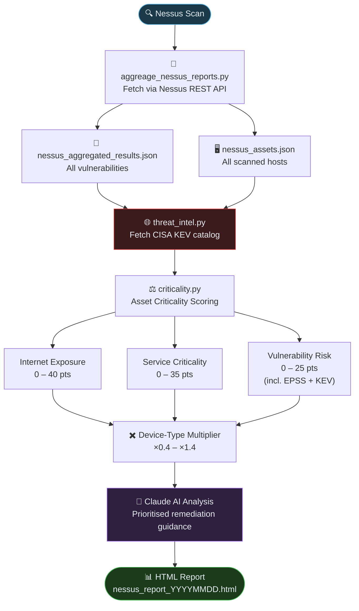

# How It Works

This page walks through the end-to-end pipeline — from pulling raw Nessus scan data to generating a prioritised HTML security report enriched with AI analysis and live threat intelligence.

---

## Pipeline Overview



---

## Step-by-Step Explanation

### Step 1 — Nessus Scan

Nessus Essentials performs an active network scan against the target IP range, identifying:

- Open ports and running services
- Known CVEs and misconfigurations
- Patch levels (with credentialed scans)

The scan results are stored within the Nessus server and accessed via its REST API — no manual HTML export required.

---

### Step 2 — Data Aggregation (`aggreage_nessus_reports.py`)

This script connects to the Nessus REST API using an **Access Key + Secret Key** and pulls raw scan data programmatically.

It produces two JSON files:

| Output file | Contents |
|---|---|
| `nessus_aggregated_results.json` | All vulnerability findings, deduplicated and enriched with CVSS, EPSS, exploit maturity, CVEs, and first/last seen dates |
| `nessus_assets.json` | Per-host summary including OS, open ports, CPE inventory, credentialed scan status, and severity counts |

Multiple scan runs are aggregated automatically — the script tracks which vulnerabilities are new, recurring, or fixed across runs.

---

### Step 3 — Threat Intelligence (`threat_intel.py`)

Before scoring, the pipeline fetches the **CISA Known Exploited Vulnerabilities (KEV) catalog** — a free, publicly maintained list of CVEs confirmed to be actively exploited by real threat actors in the wild.

- Downloaded automatically from CISA at report generation time
- Cached locally for 24 hours to avoid redundant requests
- No API key required

Any vulnerability whose CVE appears in the KEV catalog receives a **+10 boost** to the Vulnerability Risk score and is flagged with a red **KEV** badge in the report.

:::info Why KEV matters
CVSS scores measure theoretical severity. EPSS predicts exploitation probability. CISA KEV confirms actual exploitation is already happening — it is the strongest available signal that a vulnerability needs immediate attention.
:::

---

### Step 4 — Asset Criticality Scoring (`criticality.py`)

Each asset receives a **Criticality Score from 0 to 100**, calculated across three dimensions:

| Dimension | Max | What it measures |
|---|:---:|---|
| Internet Exposure | 40 | How reachable the asset is from untrusted networks |
| Service Criticality | 35 | How business-critical the running services are |
| Vulnerability Risk | 25 | Severity counts, EPSS, exploit maturity, and CISA KEV hits |

The subtotal is then multiplied by a **device-type factor** (×0.4 for mobile, up to ×1.4 for routers/gateways) to reflect inherent risk by device role.

```
Final Score = min(100, round((Exposure + Service + Vuln Risk) × Multiplier))
```

**Criticality Tiers:**

| Score | Tier |
|---|---|
| ≥ 70 | 🔴 Critical |
| 45 – 69 | 🟠 High |
| 25 – 44 | 🟡 Medium |
| < 25 | 🟢 Low |

---

### Step 5 — AI Analysis (Claude)

The aggregated vulnerability and asset data is passed to **Claude (Anthropic)** for contextual analysis.

Claude goes beyond raw CVSS scores to:

- Identify the highest-impact vulnerabilities given the asset's role and exposure
- Generate human-readable remediation summaries
- Recommend a prioritised action plan based on business risk

---

### Step 6 — HTML Report (`generate_report.py`)

The final output is a **standalone HTML report** with no external dependencies — open it in any browser without a server or internet connection.

The report includes:

- **Overview** — severity breakdown, top families, EPSS distribution
- **Vulnerabilities** — searchable, filterable table with KEV badges, exploit maturity, and expandable details
- **Assets** — criticality-scored asset cards grouped by device type
- **Software Inventory** — CPE-derived software and version list
- **Cyber Essentials** — automated CE v3.1 compliance checks
